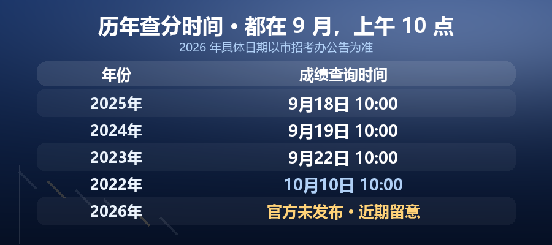
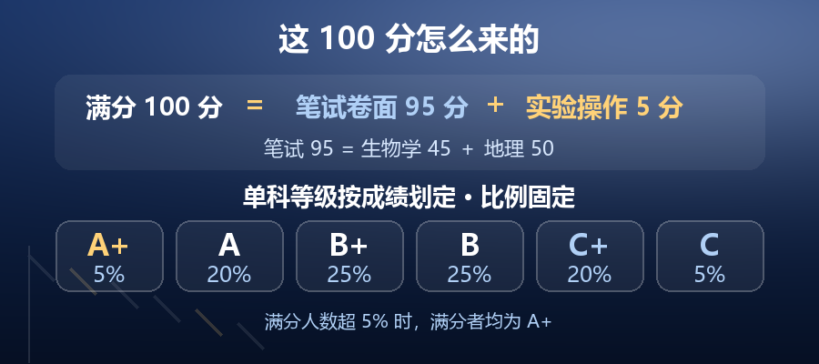
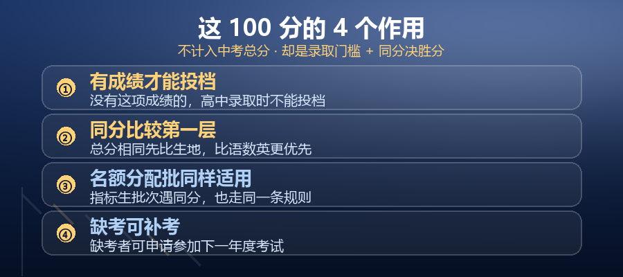

# 预告｜深圳初二生地会考成绩随时可能公布！查分入口先存好

**先说一句实在话：我不知道确切是哪一天。**

深圳市招生考试办公室到**今天（9月21日）还没有发布**成绩公布通知——所以任何人告诉你的"某月某日可查"，都不是官方口径。

但按往年规律和今年的安排，**估计就在这两三天，随时可能出分**：

- 历年生地会考成绩都在 **9月中下旬的上午10点**开放查询（2025年9月18日、2024年9月19日、2023年9月22日）；
- 今年查分系统 **9月18日—21日维护**，维护一结束就发分。

**正因为不知道是哪一天，入口才更要先存好。** 这篇文章把三件事一次说清：什么时候出、怎么查、这100分到底有什么用——**看到最后一条你就知道，这门"不计分"的课，其实一点都不能松。**

---

## 一、什么时候出？历年都在9月中下旬

据历年查分情况整理，生地会考成绩**都放在9月，而且都在上午10点开放查询**：

- 2025年：9月18日 10:00
- 2024年：9月19日 10:00
- 2023年：9月22日 10:00
- 2022年：10月10日 10:00

（2022年明显晚于其他三年，用它推算今年并不可靠。）

今年还有一个信号：**初二学考成绩查询系统在9月18日—21日进行维护，维护结束后成绩正式公布。** 所以这两天多刷一次深圳招考网的通知公告栏，或者干脆把查询页存进收藏夹。

**成绩公布当天，查询页面上的年份会从「2025」更新为「2026」，一眼就能看出来。**

---

## 二、怎么查？一个入口，三样东西

**入口只有一条路**：

深圳招考网（szeb.sz.gov.cn/szzkw/）→「**招考服务**」栏目 →「**初二学业水平考试成绩查询**」

进去后填三样：

1. **11位考生号**——报名时分配的号，别填成学籍号
2. **身份证件号后6位**——⚠️ 有字母必须填**大写**，且不带任何符号。官方例子：证件号形如 `Y023456(A)`，后6位填 `23456A`
3. **验证码**——查分页面会显示，照填即可

**最终成绩以市招考办下发的成绩单为准。** 网上查询和成绩单不一致时，以成绩单为准。

---

## 三、这门分怎么算？

生地会考官方全称是「生物学与地理（合卷）初中学业水平考试」，**满分100分**：

- **笔试卷面 95分**（生物学45分 ＋ 地理50分）
- **生物学实验操作 5分**（单独考，时长5分钟）

除了分数，还会给出**单科等级**，比例固定：A+（5%）、A（20%）、B+（25%）、B（25%）、C+（20%）、C（5%）。

⚠️ **分数和等级是并行的两种呈现。录取时真正起作用的是分数，不是等级。**

---

## 四、这100分有什么用？第2条最硬

这才是本篇文章真正要说的部分。

**① 不计入中考总分。** 深圳中考总分630分里，没有它。

很多家长因此觉得"这门课不重要"——**这是最危险的误读。**

**② ⭐ 没有这项成绩的，录取时不能投档。**

官方原文：

> ……成绩不计入中考总分，作为中考总分相同情况下的录取比较条件，**没有此项成绩的，高中阶段学校录取时不能投档**。

这是原文，不是推论。含义比"同分吃亏"严重得多：

| 情形 | 后果 |
|---|---|
| 生地在同分时分数低 | 同分比较输，可能落选 |
| **生地没有成绩** | **直接不能投档，任何学校都录不了** |

**"不计分"≠"可以不考"。它是门槛，不是加分项。**

**③ 同分比较的第一层，比语数英更优先。**

中考总分相同时，官方规定按顺序"同分比较"优先投档：

1. **生物学与地理（合卷）分数高的优先**
2. 语、数、英三科总分高的优先

两个要点：**官方公布的同分比较只有这两层**，再往后由市招考办操作细则执行（不对外公开）；**语数英不能"对冲"生地劣势**——只有生地完全相同，才轮到语数英。

**④ 名额分配批（指标生）同样适用。** 这条规则不是统招批专属。

---

## 五、两个最容易误读的说法

**「不计分，所以不用管」**——它是投档门槛。没有成绩，当年直接不能投档。这不是"少几分"，是"录不了"。

**「考完就彻底定格了」**——分两种：已考完的，分数确实改不了；**缺考的，官方明确可以申请参加下一年度考试**。但代价要清楚：**缺考期间不能投档**，等于当年直接失去录取资格。

---

## 六、现在做这3件事

**① 关注我。** 出分当天我会同步更新**查分入口和注意事项**——你关注了就直接收到，不用自己天天刷招考网。**成绩这两天随时可能出，这一条现在做最省事。**

**② 把查分入口先存进收藏夹。** 深圳招考网 →「招考服务」→「初二学业水平考试成绩查询」。别等出了分才去翻，那会儿全网都在挤。

**③ 查分当天就把分数记下来，并截图核对。** 别等填志愿才回头找，它是同分比较的第一依据，记错一位数都可能影响判断。

> 孩子还没考的（现初二）**再多做一件**：把目标分定得比心仪学校往年线高一点点。生地是"学完就考"，考完就收不回——多出来的每一分，都是对"同分比较不确定性"的保险。

---

*本文为政策信息整理，具体时间、口径与结果以深圳市教育局、深圳市招生考试办公室正式公告为准。*

---

<!-- 极简版（长图单独发布，不另出 md）：QA-006-生地会考成绩-公众号-长图-极简版-900x3360.png -->
